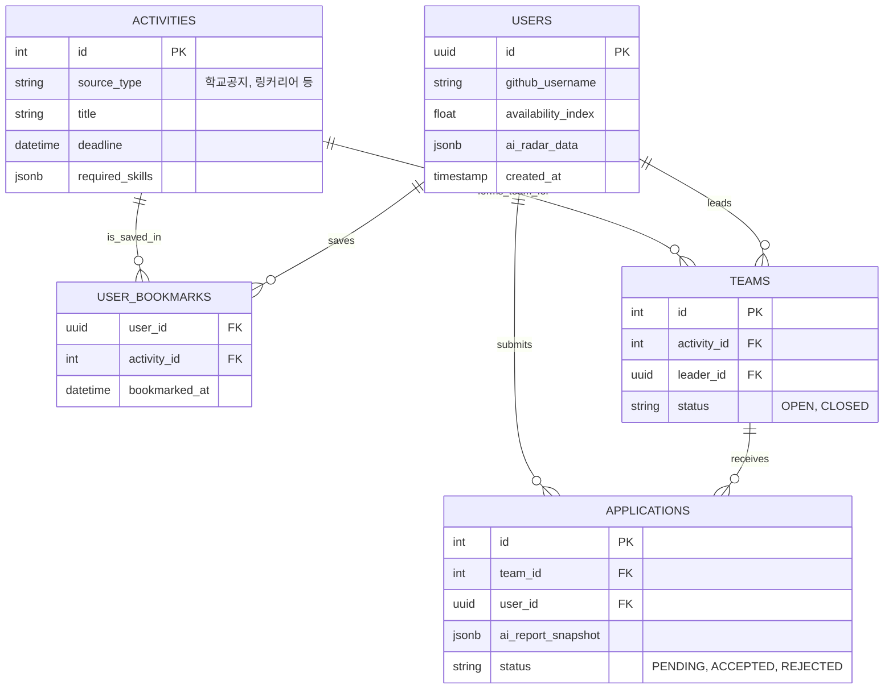

# 🚀 DevStep: Technical Product Requirements Document (PRD)

## 1. 프로젝트 개요 (Executive Summary)
- **프로젝트명**: DevStep (데이터로 설계하고 AI로 가이드하는 전공 맞춤형 커리어 로드맵)
- **목표**: 파편화된 커리어/스펙 정보를 통합하고, AI 기반 맞춤형 로드맵 제공 및 팀 빌딩을 지원하는 올인원 커리어 플랫폼
- **핵심 가치**: 데이터 기반 객관적 자기 위치 파악 + AI RAG 기반 맞춤형 합격 가이드라인 제공

---

## 2. 시스템 아키텍처 및 기술 스택 (Tech Stack & Architecture)

### 2.1 기술 스택
- **Frontend**
  - **Framework**: Next.js 14 (App Router) - SSR/SSG를 통한 SEO 최적화 및 빠른 렌더링 성능 확보
  - **State Management**: Zustand (클라이언트 전역 상태) + React Query (서버 데이터 캐싱 및 동기화)
  - **Styling**: Tailwind CSS / Framer Motion (부드러운 마이크로 인터랙션 및 모던 UI 구현)
- **Backend (API & AI Pipeline)**
  - **Framework**: FastAPI (Python) - 비동기 처리 및 데이터 분석/AI 파이프라인(LangChain) 연동에 최적화
  - **Task Queue**: Celery + Redis - 비동기 크롤러 주기적 실행 및 백그라운드 AI 리포트 생성 스케줄링
  - **ORM**: SQLAlchemy 또는 SQLModel
- **Database & Auth**
  - **BaaS**: Supabase - PostgreSQL (pgvector 확장 활용으로 RAG 시스템 구축 용이), 간편한 OAuth 및 Row Level Security(RLS) 적용
- **AI & Data**
  - **Model**: OpenAI GPT-4o API 
  - **Framework**: LangChain (RAG 파이프라인 및 프롬프트 체인 구성)
  - **Crawling**: BeautifulSoup4, Selenium (외부 활동 SPA 및 동적 페이지 병렬 스크래핑)

### 2.2 시스템 데이터 및 트래픽 흐름 (Data Flow)
1. **Data Ingestion**: FastAPI 백그라운드 워커가 크롤러를 돌려 교내외 활동 데이터를 수집하고 Supabase DB에 적재
2. **AI Analysis & Vectorization**: 사용자 OAuth 로그인 후 외부 데이터(GitHub API 등) 연동 -> AI가 텍스트/데이터를 매핑 및 벡터화 -> '레이더 차트' 및 '결핍 역량' 수치 계산
3. **RAG Serving**: 사용자가 멘토링/가이드 요청 시 `pgvector`에서 가장 유사한 합격자 벡터를 검색 후 GPT-4o에 프롬프트로 주입하여 커스텀 로드맵 응답
4. **Client Render**: Next.js에서 FastAPI로부터 받아온 데이터를 캐싱하여 피드 화면과 로드맵 시각화

---

## 3. 핵심 모듈 상세 설계 (Core Modules)

### ① AI 스펙 스캐너 & 매칭 피드 (Discovery Feed)
- **데이터 파이프라인 연동**:
  - GitHub REST/GraphQL API: Commit history, 사용 언어 비율, Repo PR 빈도.
  - 사용자 입력 데이터: 평점, 취득 자격증 명, 이전 대외활동 이력.
- **Core Logic**:
  - 수집된 스펙 데이터를 정규화하여 **6각 레이더 차트** (예: 알고리즘 설계, CS 기본기, 프론트엔드, 백엔드, 협업(Git), 오픈소스 생태계 기여) 생성.
  - 활동 테이블의 '요구 역량 벡터'와 사용자의 '결핍/부족 역량 벡터' 간 코사인 유사도(Cosine Similarity)를 계산하여, 보완 효과가 가장 큰 활동을 피드 최상단 추천.
- **주요 API Spec**:
  - `GET /api/v1/users/me/radar` : AI가 분석한 나의 스펙 레이더 차트 데이터
  - `GET /api/v1/feed/recommendations` : AI 매칭 점수에 따른 피드 데이터 제공 (Pagination 적용)

### ② 스마트 커리어 스테이터스 보드 (Status Hub)
- **기능 설계**:
  - 활동 피드에서 '찜(Bookmark)'된 아이템들의 마감 기한을 User Calendar DB로 동기화 (Google Calendar OAuth 연동 고려).
  - **활동 가능 지수 (Availability Index, AIx)** 알고리즘: 학교 별 학사일정(시험, 축제) 크롤링 데이터와 사용자의 현재 진행 프로젝트 가중치를 연산해 "현재 당신의 가용 시간 여력은 O% 입니다" 판별 표시.
- **주요 API Spec**:
  - `POST /api/v1/calendar/sync` : 캘린더 일정 동기화 및 갱신 API
  - `GET /api/v1/users/me/availability` : 활동 가능 지수 집계 API

### ③ 인턴십 합격자 패스파인더 (Roadmap RAG)
- **기능 설계 (Retrieval-Augmented Generation)**:
  - **지식 베이스**: 목표 기업/직군의 합격자 스펙(자소서, 포트폴리오 키워드 등 - PII 마스킹 필수)을 임베딩하여 Data Warehouse(pgvector)에 저장.
  - **Gap Analysis**: 내 스펙과 타겟 합격자 데이터의 갭(Gap)을 분석하고, GPT가 이를 마일스톤 단위의 JSON 배열 리스트로 쪼개어서 반환(Time-series Milestone).
- **주요 API Spec**:
  - `POST /api/v1/roadmap/generate`
    - Response 예시:
    ```json
    {
      "milestones": [
         {"deadline_str": "1개월 내", "task": "Spring Security 기반 로그인 구현", "reason": "합격자의 80%가 인증 모듈 포트폴리오 소지"},
         {"deadline_str": "3개월 내", "task": "프로그래머스 Lv.3 빈출 유형 마스터", "reason": "카카오 인턴십 코딩테스트 평균 합격선 배점 충족을 위해"}
      ]
    }
    ```

### ④ 빌드업 팀 매칭 (Team-up)
- **기능 설계**:
  - 모집글 열람/지원 시, 이력서를 일일이 보내거나 작성할 필요 없이 **AI 스펙 분석 리포트(읽기전용 뷰)** 링크를 즉시 제출.
  - 프로젝트 리더: 지원자들의 레이더 차트와 모집글의 요구 기술 스택이 얼마나 매칭되는지 % 확률로 직관적 확인 가능 (서류 검토 시간 획기적 단축).
- **주요 관련 스키마 테이블**:
  - `TeamBoard` (게시글 ID, 역할별 모집 인원, 기술 스택 배열 등)
  - `TeamApplication` (지원서 ID, 유저 ID, AI 스펙 리포트 SnapShot ID, 합불 상태)

---

## 4. 데이터베이스 ERD (도메인 모델 초안)



---

## 5. 단계별 개발 마일스톤 (Phases)

| Phase | 단계명 | 주요 구현 내용 |
|-------|---|---|
| **Phase 1** | 인프라 & 데이터 파이프라인 (2주) | Next.js 초기 세팅 및 Supabase Auth 연동. <br> FastAPI기반 Celery + Redis 크롤러 및 데이터 정규화 적재 모듈 구현 |
| **Phase 2** | AI 코어 모듈 & RAG 엔진 (2주) | OpenAI API + pgvector 연동. <br> 스펙 정량화(레이더 차트) 프롬프트 작성 및 합격자 포트폴리오 임베딩 구축 |
| **Phase 3** | 핵심 비즈니스 로직 작성 (2.5주) | Discovery Feed 매칭 로직 완료. <br> Status Hub 레이아웃(학사 캘린더 중첩 렌더) 및 활동 지수 연산 |
| **Phase 4** | 팀 빌딩 및 UX 폴리싱 (1.5주) | Team-up 게시판 설계 및 AI 리포트 스냅샷 연동 기능. <br> Framer Motion 적용(부드러운 전환) / QA 및 버그 픽스 |

---

## 6. 개발자 핵심 고려사항 (Dev Notes)
1. **비동기 데이터 갱신 비용 최적화**: 모든 크롤링을 실시간으로 가져오면 API Rate Limit이나 대기 시간 이슈가 발생합니다. 크롤링은 Celery 스케줄러를 통해 DB를 미리 갱신해두고 클라이언트는 DB 데이터를 즉시 읽어오는 Push 형태의 아키텍처를 지향해야 합니다.
2. **AI 할루시네이션(환각) 방지**: 로드맵 생성 결과값이 JSON으로 구조화되어 클라이언트에 전달되어야 합니다. GPT 파라미터 `response_format={ "type": "json_object" }` 활용과 엄격한 프롬프트 엔지니어링이 필수적입니다.
3. **컴포넌트 독립성**: 팀 빌딩에 제출되는 "AI 스펙 리포트"는 데이터 변경 시 과거 지원서의 포트폴리오까지 바뀌면 안 됩니다. 지원 시점의 데이터로 구조를 떠서(Snapshot) 별도 `JSONB` 컬럼에 저장해야 합니다.
