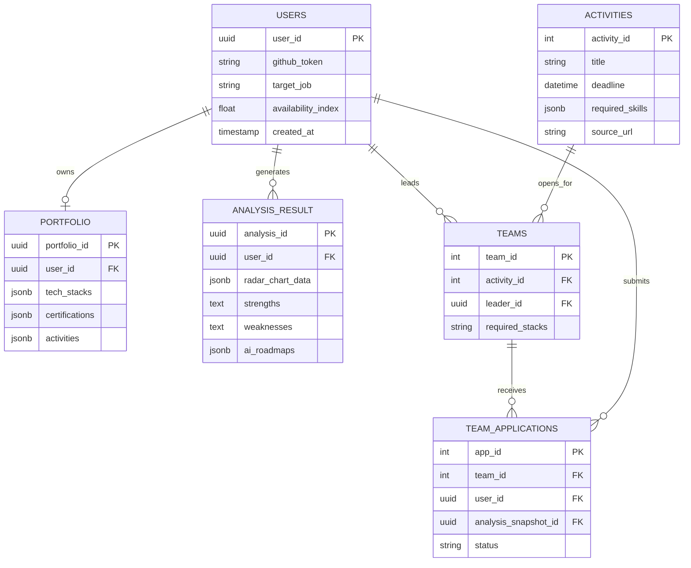

# 🚀 [최종 기획안] DevStep: AI Career Navigator

## 1. 프로젝트 개요 및 배경 (Executive Summary)

### 1.1 기획 목적 및 배경
현재 대학생들은 인턴십, 대외활동, 자격증, 공모전 등 무수히 많은 커리어 요소를 준비해야 합니다. 하지만 정보의 과잉 속에서 정작 **자신에게 어떤 역량이 부족한지 객관적으로 파악하지 못하고, 우선순위를 설정하는 데 큰 어려움**을 겪고 있습니다. 
본 프로젝트는 이러한 정보 파편화와 탐색 비용 문제를 해결하기 위해, AI가 사용자의 포트폴리오를 정밀 분석하여 역량 격차를 진단하고 개인 상황에 최적화된 학습 로드맵과 활동을 추천하는 **올인원 커리어 성장 플랫폼**입니다.

### 1.2 서비스 한 줄 소개
> **"데이터로 설계하고 AI로 가이드하는, 전공 맞춤형 커리어 로드맵 및 팀 빌딩 플랫폼"**

### 1.3 핵심 목표
- **개인별 역량 진단**: 포트폴리오 및 기술 스택 AI 정밀 분석
- **맞춤형 큐레이션**: 목표 직무/상황에 맞는 자격증, 대외활동, 공모전 1:1 추천
- **실행력 강화**: 활동 가능 지수(가용 시간) 기반 일정 관리 및 학습 로드맵 제공
- **커뮤니티 및 협업**: 동일 목표를 가진 사용자 간의 검증된 팀 빌딩 (Team-up)

---

## 2. 타겟 사용자 및 차별화 컨셉

### 2.1 타겟 사용자 (Target Audience)
1. **취업 준비 중인 대학생**: 자신의 객관적 위치를 진단하고 실질적인 취업 전략을 수립하려는 자.
2. **활동 방향 설정이 필요한 학생**: 실무 역량 강화에 실질적 도움이 되는 활동을 선별하고 싶은 자.
3. **포트폴리오 체계화 희망자**: 흩어진 이력을 통합 관리하고 전문적인 개선 방향을 얻고 싶은 자.

### 2.2 서비스 핵심 컨셉 및 차별점 (Core Edge)
AI는 단순 데이터 나열이 아닌, 다음의 핵심 인사이트를 구조화하여 제공합니다.
- **역량 격차(Gap) 분석 중심**: 합격자/직무 요구 역량 대비 현재 보유 역량의 부족분 명시.
- **맞춤형 연계성**: 분석에서 끝나지 않고 즉각적인 활동 추천 및 학습 로드맵(Task) 생성.
- **가용성 기반 일정 관리**: 학교 학사 일정(시험기간 등)을 반영한 **'활동 가능 지수'**를 도출하여 실행 가능성 극대화.

---

## 3. 핵심 기능 상세 명세 (Core Modules & Features)

### ① AI 서류 및 포트폴리오 스캐너 (Discovery Feed)
- **데이터 통합**: GitHub API, 교내성적, 취득 자격증 및 대외활동 이력 수집.
- **AI 6대 평가 항목 적용**:
  1. 목표 직무 대비 기술 역량 분석 (기술 스택)
  2. 실무 경험의 충분성
  3. 필수 자격증 보완 필요성
  4. 프로젝트 전문성
  5. 대외활동 경험의 적절성
  6. 일정 관리 및 계획성
- **결과물**: 정규화된 **'6각 역량 레이더 차트'** 생성, 강점/약점 코멘트 제공 ("OO님의 데이터베이스 역량을 15% 보완해 줄 공모전입니다").

### ② 스마트 커리어 스테이터스 보드 (Status Hub)
- **캠퍼스 동기화 및 캘린더**: 교내 학사 일정(중간/기말) 크롤링 데이터와 사용자의 캘린더를 중첩.
- **활동 가능 지수 (AIx)**: 실제 가용 시간을 계산하여 무리한 다중 활동을 방지하고 우선순위를 조정.
- **마감 알림**: 찜(하트)한 외부 활동/모집 공고 일정 자동 동기화.

### ③ 인턴십 합격자 패스파인더 (Roadmap RAG)
- **합격자 DB 연동**: 목표 기업/직무 인턴 합격자들의 공개 프로필을 VectorDB에 임베딩하여, 내 스펙과 비대칭 탐색(RAG) 비교.
- **단계별 로드맵(JSON)**: 초급 -> 중급 -> 심화에 이르는 시계열 마일스톤 가이드라인 발급. (ex. "다음 달까지 코딩 테스트 폼 올리기", "Java 기초 -> Spring Boot 프로젝트 완료")
- **인턴십 준비 리스트**: 이력서/자소서 보완 팁, 면접 체크리스트 등 제공.

### ④ 빌드업 팀 매칭 (Team-up)
- **AI 스펙 증명서 연동**: 팀 지원 시 번거로운 서류 작성 없이 본인의 'AI 기반 역량 분석 리포트' 스냅샷 첨부.
- **스마트 매칭**: 모집글의 요구 역량(Required Skills)과 지원자의 분석 결과를 % 단위의 매칭률로 직관적으로 보여주어, 리더의 기술 검증 시간 최소화.

---

## 4. 사용자 경험 프로세스 (User Flow)

1. **가입 및 초기 설정**: 소셜 로그인 후 기본 프로필(학교, 전공, 목표 직무) 설정.
2. **데이터 통합 및 입력**: GitHub 연동, 이력, 자격증, 기술 스택 입력.
3. **AI 정밀 분석**: RAG 기반 역량 분석 및 레이더 차트 생성.
4. **결과 확인 및 피드 탐색**: 강/약점 분석 확인 후 나에게 최적화된 대외활동/공모전 피드 조회.
5. **실행 계획 수립**: 추천된 활동 찜하기 -> 캘린더 자동 동기화 및 학습 로드맵 To-Do 등록.
6. **팀 빌딩 및 실행**: 활동 수행을 위해 Team-up 게시판에서 팀원 구인/구직 (스펙 인증서 활용).

---

## 5. 시스템 아키텍처 및 기술 스택

다양한 데이터 처리(크롤링/AI 엔진)와 안정적인 비즈니스 로직(회원/게시판/일정)을 효율적으로 다루기 위해 **MSA 기반 하이브리드 백엔드 구축**을 권장합니다.

- **Frontend**
  - Next.js 14 (App Router) + TypeScript
  - 상태관리: Zustand / UI 및 스타일링: Tailwind CSS, shadcn/ui, Framer Motion
- **Backend (Hybrid 구조)**
  - **Main API (Spring Boot)**: 사용자 계정 관리, 팀 매칭 도메인, 일정 관리, 커뮤니티 등 견고한 CRUD 및 비즈니스 로직 담당.
  - **AI & Data API (FastAPI / Python)**: BeautifulSoup/Selenium 기반 주기적 웹 크롤러(Celery/Redis), LangChain 및 OpenAI API 파이프라인.
- **Database**
  - PostgreSQL (Supabase 환경): 관계형 데이터베이스 및 `pgvector` 확장을 통해 Vector Search 시맨틱 검색 동시 지원.
- **AI Engine**
  - Rule-based 엔진 (명확한 수치/자격 조건) + Vector Semantic Search (포트폴리오 간 유사도, 합격자 데이터 비대칭 비교)의 *결합 하이브리드 추천 로직*.

---

## 6. 데이터베이스 ERD (초안 설계)

---

## 7. 단계별 개발 마일스톤 (Development Roadmap)

| Phase | 단계명 | 상세 태스크 내용 |
|:---:|---|---|
| **Phase 1** | 기획 및 설계 (완료) | 요구사항 정의서 종합, UI/UX 와이어프레임 설계, DB 스키마 상세 모델링 |
| **Phase 2** | 인프라 및 기반 개발 | Spring Boot / FastAPI 하이브리드 인프라 세팅. Next.js 회원가입/대시보드 UI 구현 |
| **Phase 3** | Data 파이프라인 구축 | 대외활동, 합격자 포트폴리오, 학사일정 크롤러 워커(Celery) 세팅 및 데이터 DB 적재 |
| **Phase 4** | AI 코어 및 RAG 구축 | OpenAI 연동 및 포트폴리오 정밀 분석 모델 구현. pgvector를 활용한 Semantic 추천 로직 개발 |
| **Phase 5** | 비즈니스 로직 완성 | Status Hub(일정 동기화 컴포넌트) 개발. Team-up(스펙 연동 지원) 게시판 연동 완료 |
| **Phase 6** | 테스트 및 런칭 | 기능 통합/사용성 테스트(QA), 버그 수정 및 최적화, 클라우드 환경 배포 |

---

## 8. 개발자 핵심 고려사항 (Dev Notes)
1. **백엔드 통신 분리**: AI 분석과 크롤링은 지연시간(Latency) 면에서 프론트엔드 성능을 크게 저하시킬 수 있습니다. 무거운 작업은 FastAPI + Celery 워커가 백그라운드에서 처리 후 Webhook/DB 업데이트 방식으로 Spring API 단에 넘겨주어야 합니다.
2. **AI 데이터 환각(Hallucination) 억제**: 추천 로직 출력 결과가 JSON 형태로 구조화되어 파싱되도록 프롬프트 제약 및 Response Format 옵션을 고정해야 합니다.
3. **가변 데이터 스냅샷 락**: `TEAMS`에 제출되는 분석 리포트는 시간이 지남에 따라 변동될 수 있습니다. 지원하는 시점의 Analysis_Result를 복제/스냅샷 떠서 저장해야 과거 지원 기록 시 열람 데이터 정합성을 해치지 않습니다.
